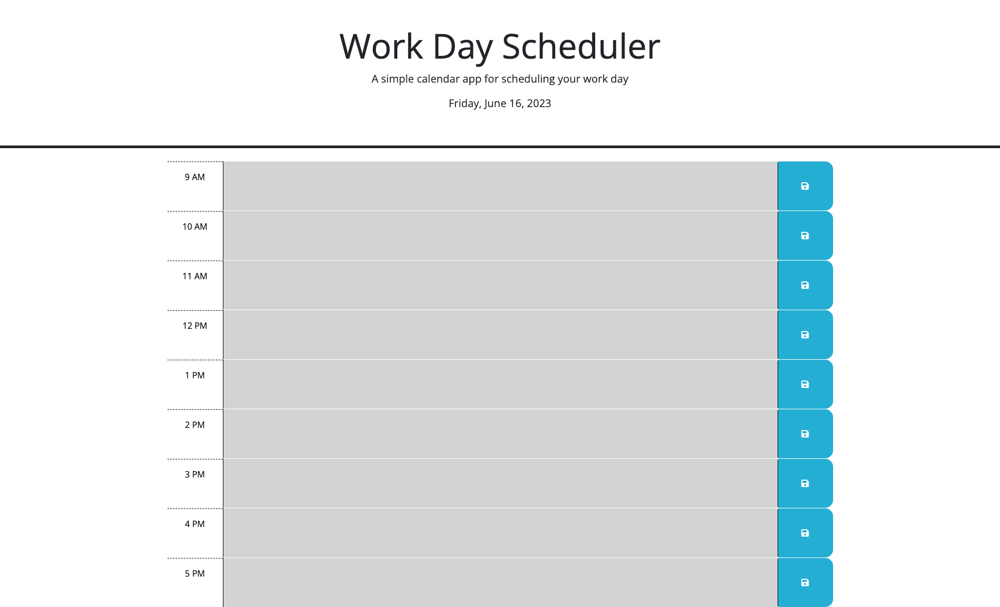

# Work Day Scheduler

A simple calendar app for scheduling your work day.

## Features

This project implements a work day scheduler that allows users to create and manage their daily schedules. It provides the following features:

- Displays the current day at the top of the calendar.
- Presents time blocks for standard business hours from 9am to 5pm.
- Color-codes each time block to indicate whether it is in the past, present, or future.
- Allows users to enter events by clicking into a time block.
- Saves the entered event text in local storage when the save button is clicked for a time block.
- Persists the saved events even after refreshing the page.

## Technologies Used

- HTML
- CSS
- JavaScript

## Dependencies

The work day scheduler relies on the following dependencies:

- jQuery 3.4.1
- Day.js 1.11.3

These dependencies are loaded from content delivery network (CDN) URLs in the `index.html` file.

## Usage

To use the work day scheduler, follow these steps:

1. Open the planner in a web browser.
2. The current day will be displayed at the top of the calendar.
3. Scroll down to view the time blocks for the current day's schedule.
4. Each time block will be color-coded based on whether it is in the past, present, or future.
5. Click into a time block to enter an event for that specific hour.
6. After entering the event, click the save button associated with the time block to save the event text in local storage.
7. The saved events will persist even if you refresh the page.

## Installation

To run the work day scheduler locally, you can follow these steps:

1. Clone the repository to your local machine or download the source code as a ZIP file.
2. Open the `index.html` file in a web browser.

Please note that a modern web browser with JavaScript support is required to run the scheduler.

## Screenshots

## Acknowledgments

With gratitude to the UC Berkeley Extension Bootcamp course instructor, teaching assistants, and Zoom video tutors for their guidance and support during the development of this project.

## Credits

This project was developed by Donahi Casas-Silva. It was created as part of the UC Berkeley Extension Coding Bootcamp curriculum and is based on the requirements in the instructional materials. The CSS and HTML for the project was provided as part of the course materials.

